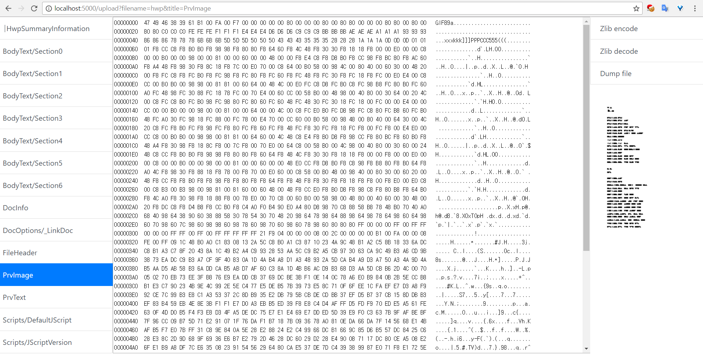

## OLE-web-viewer

### Features
- Checking the desired value by pressing the ole list button on the left
- The right side shows the corresponding value
- Dump
- addr of hex part, hex data (32 byte), ascii data format
- zlib encode, show decode results separately
- Show PrvImage on website
- Show PrvText

### how to use
- Python 2.7
- pip install olefile, flask
- Edit path of run.py
- python run.py

### maximum
- Made for personal use
- Maybe There will be a vulnerability in the code